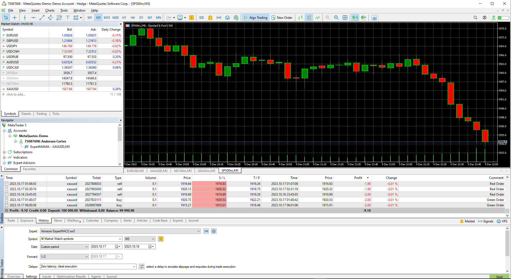
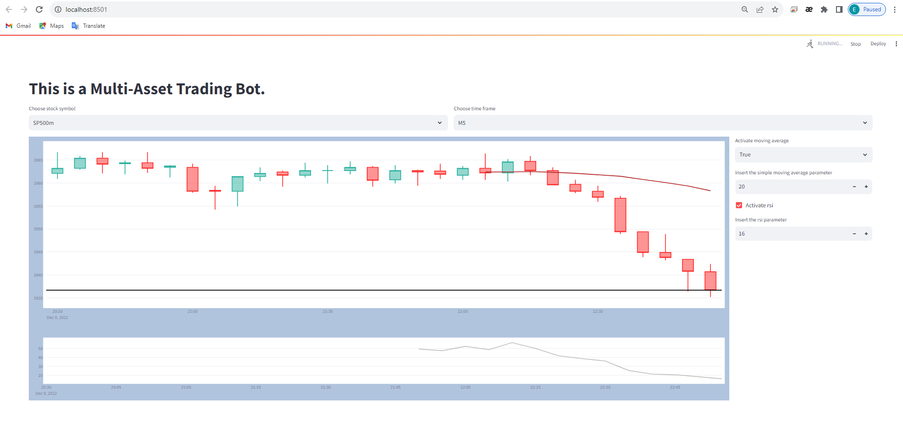

## Multi-Asset Trading Bot with AI and Real-time News Integration
A trading bot designed with the ability to trade on various indices, including US30, Nasdaq, S&P500, Ger30, and the commodity Gold. The bot should employ a combination of fundamental and technical analysis for trading decisions. Furthermore, I am interested in exploring the development of an AI-based bot that can be directly integrated with live news feeds to enhance the accuracy of fundamental analysis.

### Indices including forexs, indexes and metals
Here is some information about each of them:

1. US30: The US30, also known as the Dow Jones Industrial Average (DJIA), is a widely followed stock market index in the United States. It includes 30 large, publicly traded companies, representing a diverse range of industries.

2. Nasdaq: The Nasdaq Composite is an index that tracks the performance of over 3,000 stocks listed on the Nasdaq Stock Market, the second-largest stock exchange in the United States. It is heavily weighted towards technology and growth-oriented companies.

3. GER30: GER30 is the ticker symbol for the DAX, which is the primary stock market index for the German stock exchange, known as Deutsche Börse. The DAX consists of the 30 largest and most actively traded German companies.

4. SPX: SPX represents the S&P 500, which is one of the most famous stock market indices in the world. It includes the 500 largest publicly traded companies in the United States and covers about 80% of the available market capitalization.

5. Gold: Gold is considered a commodity. It is valued for its rarity, beauty, and use in jewelry and other decorative items. Gold is also used as a store of value and a hedge against inflation. It can be traded on commodity exchanges and its price is influenced by supply and demand factors.

These indices are widely followed by investors and provide a snapshot of how the overall stock market or specific sectors are performing.



### Fundamental & Technical Analysis
Implement a robust fundamental analysis component that can process live news feeds. The bot should be designed to analyze real-time news events that could influence the markets, with a focus on the selected assets.
Include technical analysis tools, indicators, and strategies to complement trading decisions. This can involve various chart patterns, moving averages, and other technical indicators.
- This trading bot utilize talib Python library to do this.
The talib (Technical Analysis Library) is a popular Python library used for technical analysis of financial markets. It provides a wide range of functions for computing various technical indicators, such as moving averages, oscillators, volatility measures, and more.

To get started with talib, you need to install the library using pip, the Python package manager. Open your command prompt or terminal and run the following command:

```
pip install TA-Lib
```

Once the installation is complete, you can import talib in your Python script using the following line:

```python
import talib
```

Now you can use the various functions provided by talib to compute technical indicators. For example, to compute the simple moving average (SMA) of a price series, you can use the `SMA` function, like this:

```python
sma = talib.SMA(close_prices, timeperiod=20)
```

Here, `close_prices` is a NumPy array or a Python list containing the closing prices of a financial instrument. The `timeperiod` argument specifies the number of periods over which to compute the moving average.

You can find the complete documentation for talib on the official website: https://mrjbq7.github.io/ta-lib/

Note that talib requires the underlying TA-Lib C library to be installed on your system. The Python library acts as a wrapper around the C library, so make sure to follow the installation instructions provided on the website to correctly set up talib.

### User-Friendly Interface 
Develop an intuitive user interface that allows users to monitor the bot's activity, customize settings, and review trading history.


### Customizable Strategies
Provide flexibility to customize trading strategies, entry and exit criteria, risk management parameters, and asset allocation.

### Risk Management & Backtesting
- risk management features such as stop-loss orders, take-profit levels, and position sizing algorithms to protect against substantial losses.
- backtesting feature to evaluate the bot's performance using historical data. This allows for the testing and refinement of trading strategies.